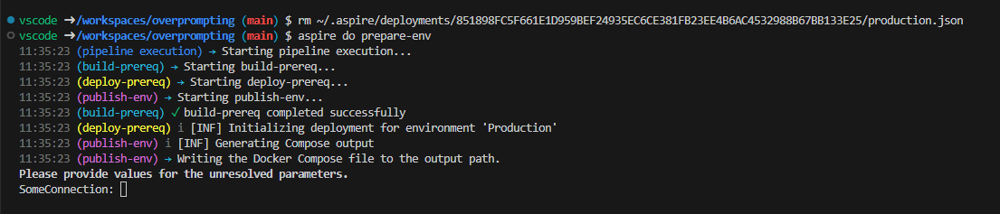
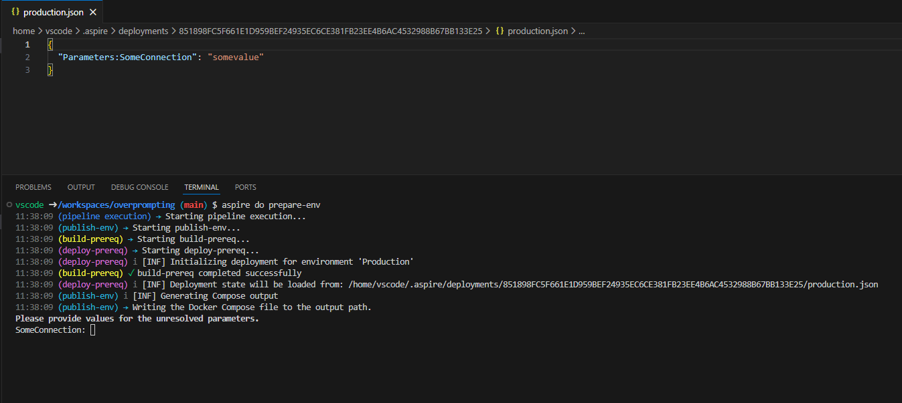

# Aspire Overprompting

### Repro steps

Open the solution in the provided Dev Container.

Inside the dev container, run `aspire do prepare-env`, the first time it prompts for 'SomeConnection':

<!-- image -->

Provide some value and continue.

Then, run `aspire do prepare-env` again. It will prompt for 'SomeConnection' again, even though it was already cached in `~/.aspire/deployments/851898FC5F661E1D959BEF24935EC6CE381FB23EE4B6AC4532988B67BB133E25/production.json`.

